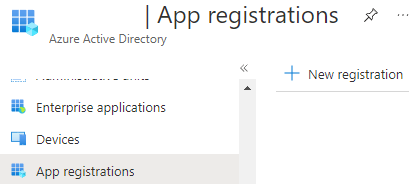
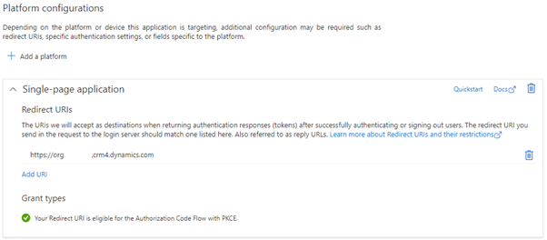
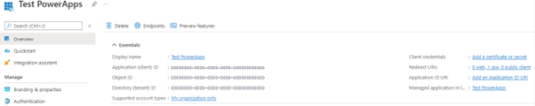
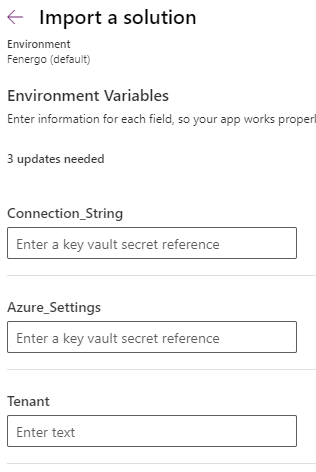
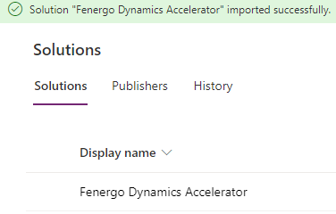
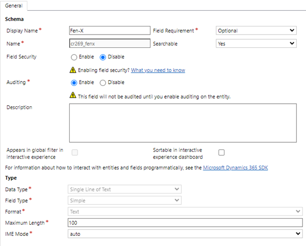
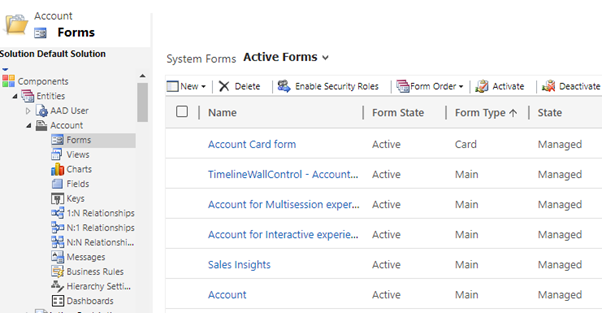
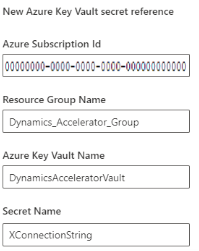
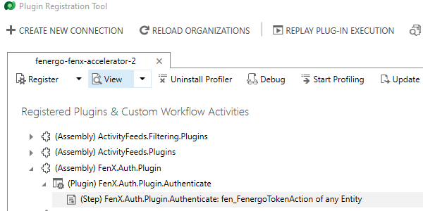
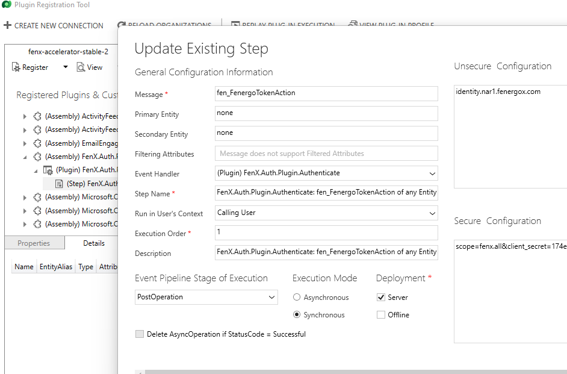

# Dynamics Accelerator PowerApps Component Framework – Solution Installation Guide (from .zip)

<strong>
<span style="color:red">
1. The Dynamics Package, associated source code and documentation is provided to Fenergo clients free of charge.<br>
2. It is, however, not supported or maintained by Fenergo.<br>
3. It would be for clients to adopt and maintain within their own technology infrastructure processes.<br>
</span></strong>

## Prerequisites

1. Existing Dynamics 365 CRM application - used to install the Accelerator into
2. Azure Enterprise Application - used for authentication
3. Azure Key Vault - used for securely storing client secrets

<strong>
<span  style="color:red">
The use of the Azure Key Vault feature has been disabled and should be re-implemented once it is released again: 

[Use Azure Key Vault secrets](https://docs.microsoft.com/en-us/power-apps/maker/data-platform/environmentvariables#use-azure-key-vault-secrets:~:text=Use%20Azure%20Key%20Vault%20secrets%20(preview))
</span>
</strong>
<br><br>
## Implement Azure Enterprise Application Requirements<br>
1. Azure App Registration<br>
*Register a new or existing application under Azure Active Directory. This is used by Dynamics to obtain user tokens for token-exchange.*<br><br>
Navigate to: [Azure Portal](https://portal.azure.com)<br><br>
1.1	Under Azure Active Directory, App Registrations, select “New registration”:<br><br>
<br><br>
1.2	Register as a Single-Page Application:<br><br>
<br><br>
1.3	Use the Dynamics CRM URL as the Redirect URI, ex: https://orgf3d565s4.crm4.dynamics.com<br>
1.4	Take note of the following GUIDs:<br><br>
<br><br>
<br><br>

<strong>
<span  style="color:red">
 The feature used in the app to access Azure Key Vault from Environment Variables has been disabled: 
 
 [Use Azure Key Vault secrets](https://docs.microsoft.com/en-us/power-apps/maker/data-platform/environmentvariables#use-azure-key-vault-secrets:~:text=Use%20Azure%20Key%20Vault%20secrets%20(preview))<br>
 The following section should only be implemented once the feature is re-enabled by Microsoft.
</span>
</strong>
<br><br>
2. Azure Key Vault Setup<br>
*The Azure Key Vault is used to store client secret info. Navigate to [Azure Portal](https://portal.azure.com)*<br>
2.1 Go to “Key vaults”<br>
2.2	Create two Secrets:<br>
2.2.1 AzureConnectionSettings<br>
2.2.2 XConnectionString<br>

2.3	Access Policy Setup<br>
2.3.1 Select "Access Policies"<br>
2.3.2 Click "Add access policy"<br>
2.3.3 Select "Secret Management" under "Configure from template"<br>
2.3.4 Check Get and List under "Secret permissions"<br>
2.3.5 Under "Select principal", search for DataVerse<br>
2.3.6 Add the DataVerse with the id: 00000007-0000-0000-c000-000000000000<br>

## Importing the Solution<br>
*Import using the provided .zip file*<br>
#### The following components will be imported (included in the solution): 
1. Environment Variable: Azure_Settings
2. Environment Variable: Tenant
3. Custom Control: fen_Fenergo.FenergoTabControl
4. Process (Action): Fenergo Token Action
5. Plug-In Assembly: FenX.Auth.Plugin
6. Plug-In Step - FenX.Auth.Plugin.Authenticate: fen_FenergoTokenAction of any Entity
7. Solution: Fenergo Dynamics Accelerator
8. Publisher: Fenergo (prefix: fen)

### Steps to Import
*This method requires the user to import from make.powerapps.com*<br><br>
1. Navigate to:  [PowerApps](https://make.powerapps.com)
2. Ensure you have selected the correct environment, for example:<br><br>
<br><br>
3.	Select Solutions from the left-hand navigation and select "Import solution".
4.	Select your zipped solution. <br>
4.1  Skip over the Environment Variables setup for now:<br><br>
<br><br>
4.2  Import the solution. The import should take a few minutes.<br>
4.3  Should the import fail, check under the History tab for more info.
5.	Common errors:<br>
	a.	Publisher prefix dev for this control Fenergo.TabControl does not match the prefix cr269 for the solution with Id 316c48cc-4eb2-4a80-8426-c2291252caf1<br>
		i.	Ensure that the same publisher has been used for both the solution being imported and its Custom Control. <br>
	b.	ImportCustomControlException: CustomControl with name Fenergo.TabControl failed to import with error: Webresource content size is too big.<br>
		i.	Navigate to Advanced Settings, Settings, Administration -> System Settings<br>
		ii.	In the Email tab, change the Maximum file size to 32120 (default is 5120).<br>
6.	When successful, the solution will appear in the Solutions list.
<br><br>


## Configuring the Imported Solution<br>
### Prerequisite<br>
1. The solution must be imported (see Importing a Solution)<br>
2. Create new field, naming is not important:<br><br>
<br><br>


### Adding the PCF as a control:<br>
1.	Navigate to Advanced Settings, Customizations -> Customize the System.<br>
2.	Navigate to the Dynamics Entity in which the PCF will be installed.<br>
3.	Expand the Entity. Select the Form in which the PCF will be installed:<br><br>
<br><br>
4.	Create a new section for the custom field:<br>
	a.	In the form view, select Insert -> “One Column”:<br><br>
<br><br>
	b.	A new Tab is created:<br><br>
<br><br>
	c.	In the Field Explorer on the right, select “Custom Fields” and drag the new field to the new tab:<br><br>
	d.	Double-click the new form element (or select it and select Home -> “Change Properties”).<br>
	e.	In “Field Properties”, uncheck “Display label on the form”.<br>
	f.	Select the Control tab and click “Add Control”. 
	g.  Look for and add the "Fenergo TabControl"<br><br>
	h.	Fill in the required values:<br><br>
<br><br>

### Configure the Environment Variables:<br>
1. Navigate to:  [PowerApps](https://make.powerapps.com)
2. Open the solution: Fenergo Dynamics Accelerator
3. Configure Environment Variables
*Environment Variables are required for the secure using of client secrets.*<br><br>
*Ensure you are on the correct environment by selecting it from here:*<br><br>
<br><br>
4. The environment variables to configure are:<br><br>
<br><br>

<strong>
<span  style="color:red">
The feature used in the app to access Azure Key Vault from Environment Variables has been disabled:<br>
</span>
</strong>

[Use Azure Key Vault secrets](https://docs.microsoft.com/en-us/power-apps/maker/data-platform/environmentvariables#use-azure-key-vault-secrets:~:text=Use%20Azure%20Key%20Vault%20secrets%20(preview))
<br>
<strong>
<span  style="color:red">
 The following section should only be implemented once the feature is re-enabled by Microsoft.<br>
 The alternative solution is listed in section 6 and 7 below.<br>
</span>
</strong>

5 For Azure_Settings and Connection_String, select the “Secret Store” to be used: Azure Key Vault.<br>
5.1 Fill in the required Azure vault info for **AzureConnectionSettings**:<br><br>
<br><br>
5.2 Fill in the required Fen-X Connection string vault info for **XConnectionString**:<br><br>
<br><br>
5.3 For Tenant, add your Fen-X tenant ID as the Current Value.<br><br>

<strong>
<span  style="color:red">
 Section 6 and 7 should be implemented as an alternative to section 5 above.
</span>
</strong>
<br><br>
6 For Azure_Settings, select the "Text” data type.<br>
6.1 Select "Current Value" and fill in the required Azure settings: <br>
{"scopes": "user.read","clientid": "AZURE_CLIENT_ID","tenantid": "AZURE_TENANT_ID","redirect": "https://[DYNAMICS ENVIRONMENT ORG].crm4.dynamics.com"}<br>
<br><br>

7 Add the connection string to the plugin.<br>
7.1 Download the Plugin Registration Tool (PRT): [docs.microsoft.com](https://docs.microsoft.com/en-us/dynamics365/customerengagement/on-premises/developer/download-tools-nuget?view=op-9-1)<br>
7.2 Navigate to the downloaded PRT folder. Should you struggle logging in, do the following:<br>
7.2.1 Edit PluginRegistration.exe.config<br>
7.2.2 Uncomment or re-add:<br>

```xml
<appSettings> <add key="MaxCrmConnectionTimeOutMinutes" value="20" /> <add key="SkipDiscovery" value="true" /> </appSettings>
```
<br>
7.3 Click CREATE NEW CONNECTION<br>
7.4 Login with Dynamics account details<br>
7.5 If asked, paste the Instance url. ex. https://org.crm4.dynamics.com<br>

7.6 Update the plug-in.<br>
7.6.1 Find the plug-in, select the (Step) and click Update:<br>
<br>
7.6.2 Add the connection string to the "Secure Configuration":<br>
`scope=openid+tenant&client_secret=FENX_CLIENT_SECRET&client_id=FENX_CLIENT_ID&grant_type=external-token-exchange`<br>
<br><br>

8 For Tenant, add your Fen-X tenant ID as the Current Value.<br><br>

-- This completes the Solution Installation Guide (from .zip) --

# Manual Installation Guide

## Dynamics Entity Configuration

1. Select entity that maps to Fenergo Legal Entity
2. Edit entity data table in [Dataverse](https://docs.microsoft.com/en-us/dynamics365/customerengagement/on-premises/customize/edit-entities?view=op-9-1) and add new data field "FenergoEntityId"
3. Edit entity form in [PowerApps](https://docs.microsoft.com/en-us/power-apps/maker/canvas-apps/controls/control-form-detail)
4. On chosen form, add a new tab
5. Add the earlier created data field "FenergoEntityId" to the new tab
6. Click on the field and [add "Fenergo Tab Control"](https://docs.microsoft.com/en-us/power-apps/maker/model-driven-apps/use-custom-controls-data-visualizations)

## Importing Fen-X Tab Control

1. Download and install [npm](https://www.npmjs.com/get-npm)
2. Download and install [PowerApps CLI](https://aka.ms/PowerAppsCLI)
3. Open PowerShell
4. Execute command ```pac auth create -url {url to dynamics instance}```
5. Navigate to "{solution path}\FenX.Tab.Control" folder
6. Execute command ```npm run build```
7. Execute command ```pac pcf push --publisher-prefix {configured publisher}```

## Registering Fen-X Auth Plugin
### Requirements
Plugin Registration Tool: [docs.microsoft.com](https://docs.microsoft.com/en-us/dynamics365/customerengagement/on-premises/developer/download-tools-nuget?view=op-9-1)
Visual Studio 2019 with .Net Framework 4.6.2
### Preparation
#### Visual Studio 2019:
*	Open solution: FenX.Auth.Plugin.sln
*	Run build
#### Dynamics Setup
* Navigate to Advanced Settings -> Customizations
* Click: Customize the System
* Open Processes, click New
* Create Process:
	* Process name: [this along with the prefix will be used to reference the action] [Currently hardcoded as: **fen_FenergoTokenAction**]
	* Category: Action
	* Entity: None (global) 
* Create these exact Process Arguments:
	* AzureToken, String, Optional, Input
	* FenXToken, String, Optional, Output
* Save
* Activate
#### Plugin Registration Tool (PRT)
* Navigate to the downloaded PRT folder
* Edit the file: PluginRegistration.exe.config
* The following is needed when struggling to log in with the PRT:<br> 
* Uncomment or re-add the following: 
```xml  <appSettings>
    <add key="MaxCrmConnectionTimeOutMinutes" value="20" />
	    <add key="SkipDiscovery" value="true" />
  </appSettings>
  ```
* Click CREATE NEW CONNECTION
* Login with Dynamics account details
* If asked, paste the correct Instance url. ex. https://org.crm4.dynamics.com
#### Import Plugin
* In the Plugin Registration Tool, click Register, Register new Assembly
* Load the assembly
* Select the activities to register
* Click Register Selected Plugins
#### Setup
* Navigate to the plugin within the Plugin Registration Tool
* Register New Step on the plugin:
	* Message: Use the name of the Action created above (starts with a prefix) [Currently hardcoded as: **new_FenergoTokenAction**]
	* Primary Entity: none
	* Secondary Entity: none
	* Run in User's Context: Calling User
	* Event Pipeline Stage of Execution: PostOperation
	* Execution Mode: Synchronous
	* Secure Configuration: `scope=openid+tenant&client_secret=FENX_CLIENT_SECRET&client_id=FENX_CLIENT_ID&grant_type=external-token-exchange`
## Enable Plug-In Tracing (Optional, for debugging)
1. In your existing application, navigate to Advanced Settings, Administration -> System Settings<br>
2. Under the Customization tab, change "Enable logging to plug-in trace log" to All <br>
3. Click OK<br><br>