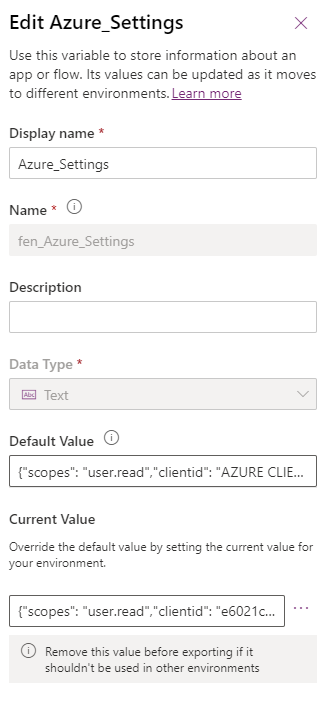

# Dynamics Accelerator PowerApps Component Framework – Enable Token Exchange

<strong>

1. The Dynamics Package, associated source code and documentation is provided to Fenergo clients free of charge. 
2. It is, however, not supported or maintained by Fenergo. 
3. It would be for clients to adopt and maintain within their own technology infrastructure processes. 
</strong>

## Prerequisites

1. Existing Dynamics 365 CRM application
2. Azure Enterprise Application
3. Access to the Plugin Registration Tool
4. Users registered on Fen-X to use with Token Exchange

## CRM Configuration
### Configure the PCF properties: 

1. In your existing application, navigate to where the PCF is installed on the entity  

2. Open the "Field Properties" (double-click the field or click on "Change Properties")  

3. Under Controls, change the value of "Enable_Token_Exchange" to true:  

  

### Configure the Azure Settings Environment Variable: 

1. Navigate to: [PowerApps](https://make.powerapps.com)
2. Open the solution: Fenergo Dynamics Accelerator
3. Select the "Azure_Settings" item
4. Fill in the required info:  

  

## Plugin Registration Tool
### Update the connection string
1. Open the Plugin Registration Tool
2. Connect to your organization
3. Find and open the Plugin step:   
   
4. Add the connection string into the "Secure Configuration" section:  
   
5. Note the format of the connection string should be as follows: 
5.1 %20 to be used for spaces 
5.2 & added between categories 
**scope=openid%20tenant%20fenx.all&client_secret=**