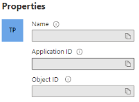

**

	
# Dynamics Accelerator PowerApps Component Framework – Solution Uninstall Guide

<strong>
<span style="color:red">
1. The Dynamics Package, associated source code and documentation is provided to Fenergo clients free of charge.<br>
2. It is, however, not supported or maintained by Fenergo.<br>
3. It would be for clients to adopt and maintain within their own technology infrastructure processes.<br>
</span></strong>

## How To Use This Guide
The components used in this solution are natively cached by Dynamics. These components need to be manually removed before their newer versions can be updated. This guide can be used before a solution is imported or when an existing solution is updated. The guide explains how to remove components within a solution before removing the solution itself.

## Delete Components From Environment
1. Select the solution:
<br><br>
2. Select and "Turn off" the "Fenergo Token Action" Workflow:
<br><br>
3. Select all the components and select "Delete from this environment":
<br><br>
   1. If any failures occur, manually delete each component.
4. Click "Back to solutions"
5. Select the solution and click Delete.


## Implement Azure Enterprise Application Requirements<br>
1. Azure App Registration<br>
*Register a new or existing application under Azure Active Directory for dynamics to obtain user tokens used for the token-exchange workflow in accordance with Fen-X.*<br>
*Complete the following to register an application [Azure Portal](https://portal.azure.com):*<br><br>
1.1	Under Azure Active Directory, App Registrations, select “New registration”:<br><br>
<br><br>
1.2	Register as a Single-Page Application:<br><br>
<br><br>
1.3	Use your Dynamics CRM URL as the Redirect URI.<br>
1.4	Take note of the following GUIDs:<br><br>
<br><br>
<br><br>
2.	Azure Key Vault Setup<br>
*The Azure Key Vault is used to store client secret info. Navigate to [Azure Portal](https://portal.azure.com)*<br><br>
2.1 	Go to “Key vaults”<br>
2.2	Create two Secrets:<br>
	a. AzureConnectionSettings<br>
	b. XConnectionString<br><br>
2.3	Access Policy Setup<br>
	a. Select "Access Policies"<br>
	b. Click "Add access policy"<br>
	c. Select "Secret Management" under "Configure from template"<br>
	d. Check Get and List under "Secret permissions"<br>
	e. Under "Select principal", search for DataVerse<br>
	f. Add the DataVerse with the id: 00000007-0000-0000-c000-000000000000<br>

## Importing the Solution<br>
*Import using the provided .zip file*<br><br>
#### The following components will be imported (included in the solution): 
1. Environment Variable: Azure_Settings
2. Environment Variable: Connection_String
3. Environment Variable: Tenant
4. Custom Control: fen_Fenergo.FenergoTabControl
5. Process (Action): Fenergo Token Action
6. Plug-In Assembly: FenX.Auth.Plugin
7. Plug-In Step: FenX.Auth.Plugin.Authenticate: fen_FenergoTokenAction of any Entity
8. Solution: Fenergo Dynamics Accelerator<br><br>
9. Publisher: Fenergo (prefix: fen)

### Steps to Import
*This method requires the user to import from make.powerapps.com*<br><br>
1. Navigate to:  [PowerApps](https://make.powerapps.com)
2. Ensure you have selected the correct environment, for example:
<br><br>
3.	Select Solutions from the left-hand navigation and select "Import solution".
4.	Select your zipped solution. <br>
4.1  Skip over the Environment Variables setup for now:<br><br>
<br><br>
4.2  Import the solution. The import should take a few minutes.<br>
4.3  Should the import fail, check under the History tab for more info.
5.	Common errors:<br>
	a.	Publisher prefix dev for this control Fenergo.TabControl does not match the prefix cr269 for the solution with Id 316c48cc-4eb2-4a80-8426-c2291252caf1<br>
		i.	Ensure that the same publisher has been used for both the solution being imported and its Custom Control. <br>
	b.	ImportCustomControlException: CustomControl with name Fenergo.TabControl failed to import with error: Webresource content size is too big.<br>
		i.	Navigate to Advanced Settings, Settings, Administration -> System Settings<br>
		ii.	In the Email tab, change the Maximum file size to 32120 (default is 5120).<br>
6.	When successful, the solution will appear in the Solutions list.
<br><br>


## Configuring the Imported Solution<br>
### Prerequisite<br>
1. The solution must be imported (see Importing a Solution)<br>
2. Create new field, naming is not important:<br><br>
<br><br>


### Adding the PCF as a control:<br>
1.	Navigate to Advanced Settings, Customizations -> Customize the System.<br>
2.	Navigate to the entity in which the PCF will be installed.<br>
3.	Expand the entity, navigate to, and select the Form in which the PCF will be installed:<br><br>
<br><br>
4.	From here there are multiple options to install the PCF. They may be client specific. Here is the default way:<br>
	a.	In the form view, select Insert -> “One Column”:<br><br>
<br><br>
	b.	A new Tab is created:<br><br>
<br><br>
	c.	In the Field Explorer, select “Custom Fields” and drag the new field to the new tab:<br><br>
<br><br>
	d.	Double-click the new form element or select it and select Home -> “Change Properties”.<br>
	e.	In “Field Properties”, uncheck “Display label on the form”.<br>
	f.	Select the Control tab and click “Add Control”. Look for TabControl:<br><br>
<br><br>
	g.	Fill in the required values:<br><br>
<br><br>

### Configure the Environment Variables:<br>
1. Navigate to:  [PowerApps](https://make.powerapps.com)
2. Open the solution: Fenergo Dynamics Accelerator
3. Configure Environment Variables
*Environment Variables are required for the secure using of client secrets.*<br><br>
*Ensure you are on the correct environment by selecting it from here:*<br><br>
<br><br>
4. The environment variables to configure are:<br><br>
<br><br>
5 For Azure_Settings and Connection_String, select the “Secret Store” to be used: Azure Key Vault.<br>
5.1 Fill in the required Azure vault info for **AzureConnectionSettings**:<br><br>
<br><br>
2.6.2 Fill in the required Fen-X Connection string vault info for **XConnectionString**:<br><br>
<br><br>
2.7 For Tenant, add your Fen-X tenant ID as the Current Value.<br><br>

-- This completes the Solution Installation Guide (from .zip) --

# Manual Installation Guide

## Dynamics Entity Configuration

1. Select entity that maps to Fenergo Legal Entity
2. Edit entity data table in [Dataverse](https://docs.microsoft.com/en-us/dynamics365/customerengagement/on-premises/customize/edit-entities?view=op-9-1) and add new data field "FenergoEntityId"
3. Edit entity form in [PowerApps](https://docs.microsoft.com/en-us/power-apps/maker/canvas-apps/controls/control-form-detail)
4. On chosen form, add a new tab
5. Add the earlier created data field "FenergoEntityId" to the new tab
6. Click on the field and [add "Fenergo Tab Control"](https://docs.microsoft.com/en-us/power-apps/maker/model-driven-apps/use-custom-controls-data-visualizations)

## Importing Fen-X Tab Control

1. Download and install [npm](https://www.npmjs.com/get-npm)
2. Download and install [PowerApps CLI](https://aka.ms/PowerAppsCLI)
3. Open PowerShell
4. Execute command ```pac auth create -url {url to dynamics instance}```
5. Navigate to "{solution path}\FenX.Tab.Control" folder
6. Execute command ```npm run build```
7. Execute command ```pac pcf push --publisher-prefix {configured publisher}```

## Registering Fen-X Auth Plugin
### Requirements
Plugin Registration Tool: [docs.microsoft.com](https://docs.microsoft.com/en-us/dynamics365/customerengagement/on-premises/developer/download-tools-nuget?view=op-9-1)
Visual Studio 2019 with .Net Framework 4.6.2
### Preparation
#### Visual Studio 2019:
*	Open solution: FenX.Auth.Plugin.sln
*	Run build
#### Dynamics Setup
* Navigate to Advanced Settings -> Customizations
* Click: Customize the System
* Open Processes, click New
* Create Process:
	* Process name: [this along with the prefix will be used to reference the action] [Currently hardcoded as: **fen_FenergoTokenProcess**]
	* Category: Action
	* Entity: None (global) 
* Create these exact Process Arguments:
	* AzureToken, String, Optional, Input
	* FenXToken, String, Optional, Output
* Save
* Activate
#### Plugin Registration Tool (PRT)
* Navigate to the downloaded PRT folder
* Edit the file: PluginRegistration.exe.config
* The following is needed when struggling to log in with the PRT: 
Uncomment or re-add the following: `  <appSettings>
    <add key="MaxCrmConnectionTimeOutMinutes" value="20" />
	    <add key="SkipDiscovery" value="true" />
  </appSettings>`
* Click CREATE NEW CONNECTION
* Login with Dynamics account details
* If asked, paste the Instance url. ex. https://orgf5672123.crm4.dynamics.com
#### Import Plugin
* In the Plugin Registration Tool, click Register, Register new Assembly
* Load the assembly
* Select the activities to register
* Click Register Selected Plugins
#### Setup
* Navigate to the plugin within the Plugin Registration Tool
* Register New Step on the plugin:
	* Message: Use the name of the Action created above (starts with a prefix) [Currently hardcoded as: **new_FenergoTokenProcess**]
	* Primary Entity: none
	* Secondary Entity: none
	* Run in User's Context: Calling User
	* Event Pipeline Stage of Execution: PostOperation
	* Execution Mode: Synchronous 
	* Secure Configuration: `scope=openid+tenant&client_secret=00000000-0000-0000-0000-000000000000&client_id=your-client-for-tokenexchange&grant_type=external-token-exchange`
	**